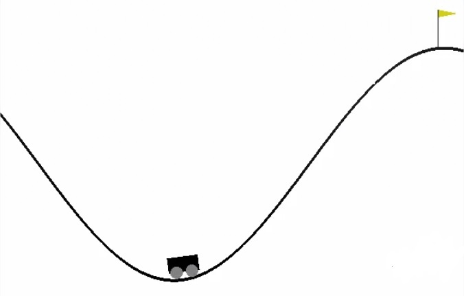

# Reinforcement Learning - Q Learning from Scratch
* The notebook contains an implementation of reinforcement learning with simple q learning from scratch (using only numpy). I used this implementation to solve the mountain car environment (of Gym by OpenAI - https://gym.openai.com/envs/MountainCar-v0/ ).

* Using this implementation of q learning, I was able to solve the environment, so at some point the car had succeeded to reach the goal in every episode (the uphill flag), as can be seen in the graphs in the notebook.

For a better view of the notebook: https://nbviewer.jupyter.org/github/MiaDor12/Reinforcement_Learning-Q_Learning_from_Scratch/blob/master/Reinforcement_Learning_MountainCar.ipynb
